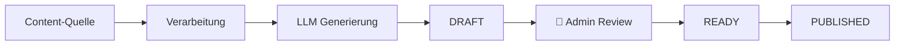

# catchKen Content Hub

A web-based social media content planner for Swiss driving schools. Automates content generation for Instagram & TikTok using local LLMs, featuring calendar-based scheduling, RSS-powered news posts, theory content, student success stories, and review highlights.

> **Status:** Phase 1 – Foundation (in progress)

---

## Demo

<!-- Screenshot hier einfügen sobald UI existiert -->
*Coming soon – UI wird in Phase 2 gebaut.*

---

## Tech Stack

| Komponente         | Technologie                          |
| ------------------ | ------------------------------------ |
| Backend            | Python 3.13 / FastAPI                |
| Datenbank          | SQLite → PostgreSQL (geplant)        |
| ORM                | SQLAlchemy                           |
| LLM                | Ollama lokal (OpenAI als Fallback)   |
| Frontend (MVP)     | HTML / CSS / JavaScript              |
| Frontend (geplant) | React                                |
| Auth               | Passlib + bcrypt                     |
| CI/CD              | GitHub Actions                       |

---

## Features

### Vier Content-Typen
- **Erfolgs-Posts** – Bestandene Fahrschüler:innen mit Bild, Caption & Hashtags
- **News-Posts** – Automatisch aus Schweizer RSS-Feeds (SRF etc.) mit Sicherheitstipps
- **Theorie-Posts** – Generierte Inhalte zur Schweizer Theorieprüfung mit Quiz
- **Rezensionen** – Google Reviews als Social-Media-Content aufbereitet

### Planungssystem
- Kalenderansicht (Woche / 2 Wochen / Monat)
- Drag & Drop Planung
- Status-Workflow: `DRAFT` → `READY` → `PUBLISHED`
- Sidebar mit ungeplanten Inhalten

### Export
- ZIP-Download mit CSV-Zeitplan, Bildern, Captions & Checkliste
- Kein Auto-Posting im MVP – volle redaktionelle Kontrolle

---

## Setup (Lokale Entwicklung)

### Voraussetzungen
- Python 3.13+
- Git
- [Ollama](https://ollama.ai/) (für lokale LLM-Generierung)

### Installation
```bash
# 1. Repository klonen
git clone https://github.com/NoahRolli/contentHub_catchKen.git
cd contentHub_catchKen

# 2. Virtuelle Umgebung erstellen und aktivieren
python3 -m venv .venv
source .venv/bin/activate  # macOS/Linux
# .venv\Scripts\activate   # Windows

# 3. Abhängigkeiten installieren
pip install -r requirements.txt

# 4. Umgebungsvariablen konfigurieren
cp .env.example .env
# Dann .env mit deinen Werten anpassen

# 5. Server starten
uvicorn app.main:app --reload
```

### Zugriff
- **App:** http://127.0.0.1:8000
- **API Docs:** http://127.0.0.1:8000/docs
- **Health Check:** http://127.0.0.1:8000/health

---

## Projektstruktur
```
catchKen/
├── app/
│   ├── core/                  # Infrastruktur (Config, DB, Security)
│   │   ├── config.py          # App-Einstellungen aus .env
│   │   ├── database.py        # DB-Verbindung & Session-Management
│   │   └── security.py        # Passwort-Hashing, Auth (Phase 2)
│   ├── models/                # Datenbank-Tabellen (SQLAlchemy)
│   ├── schemas/               # API Request/Response Formate
│   ├── routers/               # API-Endpunkte
│   ├── services/              # Geschäftslogik
│   │   └── llm/               # Ollama/OpenAI Integration
│   ├── utils/                 # Hilfsfunktionen
│   └── main.py                # FastAPI Einstiegspunkt
├── frontend/
│   ├── static/                # CSS, JS, Bilder
│   └── templates/             # HTML Templates (Jinja2)
├── tests/                     # Pytest Tests
├── media/ → SSD Symlink       # Uploads (nicht im Repo)
├── .env.example               # Vorlage für Umgebungsvariablen
├── .gitignore
├── requirements.txt
└── README.md
```

---

## Roadmap

| Phase | Beschreibung                  | Status        |
| ----- | ----------------------------- | ------------- |
| 1     | Fundament & Projektstruktur   | 🔄 In Arbeit  |
| 2     | Erfolgs-Posts (CRUD)          | ⏳ Geplant    |
| 3     | LLM-Integration (Ollama)      | ⏳ Geplant    |
| 4     | Theorie-Posts                 | ⏳ Geplant    |
| 5     | News-Posts (RSS)              | ⏳ Geplant    |
| 6     | Rezensionen                   | ⏳ Geplant    |
| 7     | Kalender & Planung            | ⏳ Geplant    |
| 8     | Export & Polish               | ⏳ Geplant    |
| 9     | React-Migration (optional)    | ⏳ Geplant    |

---

## Content Pipeline


*Detailliertes Diagramm: [docs/content-pipeline.md](docs/content-pipeline.md)*

## Sicherheit

- Secrets in `.env` (nie im Code oder auf GitHub)
- Passwort-Hashing mit bcrypt
- SQLAlchemy ORM (schützt gegen SQL-Injection)
- Pydantic Validierung aller Eingaben
- Consent-Pflicht für Schülerbilder
- Keine vollständige Artikelübernahme (nur LLM-Zusammenfassungen)

---

## Lizenz

*Noch nicht definiert.*

---

## Autor

**Noah Rolli** – [GitHub](https://github.com/NoahRolli)