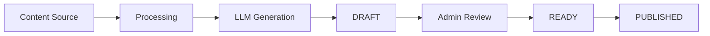
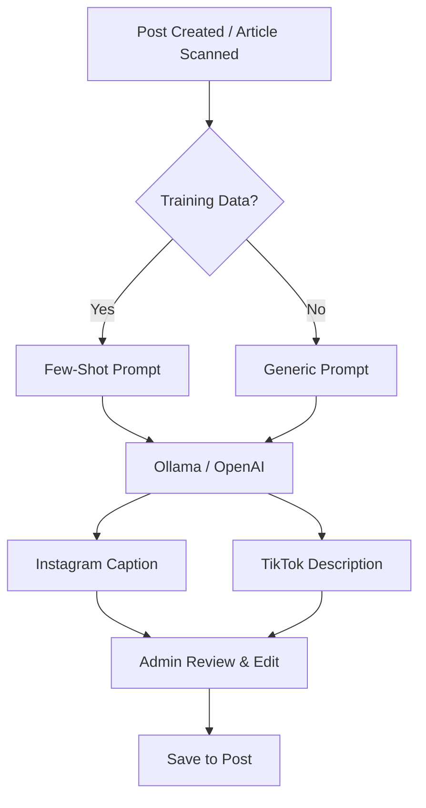
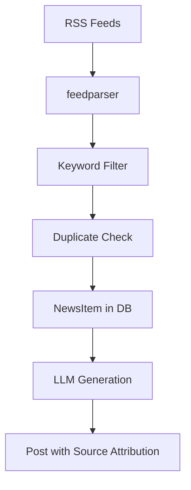

# catchKen Content Hub

AI-powered social media content planner for a Swiss driving school (Fahrschule Catch Ken, Basel). Automates content generation for Instagram & TikTok using local LLMs, featuring calendar-based scheduling, RSS-powered news posts, theory content, student success stories, and training data management.

**Work in Progress – Phase 5 complete**

-----

## Demo

> *Screenshots coming soon*

-----

## Tech Stack

|Component         |Technology                                               |
|------------------|---------------------------------------------------------|
|Backend           |Python 3.13 · FastAPI · SQLAlchemy · SQLite              |
|Frontend (MVP)    |HTML · CSS · JavaScript                                  |
|Frontend (planned)|React                                                    |
|AI                |Ollama local (OpenAI as fallback) — switchable via `.env`|
|HTTP Client       |httpx (async, for LLM communication)                     |
|RSS Parsing       |feedparser                                               |
|Auth              |Passlib · bcrypt                                         |
|CI/CD             |GitHub Actions (ruff linting · pytest · auto-docs)       |
|Containerization  |Docker · docker-compose                                  |

-----

## Project Structure

```
catchKen/
├── app/
│   ├── main.py                    # FastAPI entry point
│   │
│   ├── core/                      # Infrastructure
│   │   ├── config.py              # App settings from .env
│   │   ├── database.py            # SQLAlchemy engine & sessions
│   │   └── security.py            # Password hashing (bcrypt)
│   │
│   ├── models/                    # Database models (9 tables)
│   │   ├── user.py                # Admin accounts
│   │   ├── student_success_post.py # Passed students content
│   │   ├── theory_post.py         # Driving theory content
│   │   ├── training_post.py       # Training data for few-shot prompting
│   │   ├── content_source.py      # RSS feeds, Google Reviews
│   │   ├── news_item.py           # Scanned news articles
│   │   ├── content_idea.py        # LLM-generated suggestions
│   │   ├── scheduled_post.py      # Calendar entries
│   │   └── asset.py               # Images, videos
│   │
│   ├── schemas/                   # Pydantic request/response models
│   │   ├── student_success.py     # Success post + LLM generation schemas
│   │   ├── theory_post.py         # Theory post schemas
│   │   ├── news.py                # News + content source schemas
│   │   ├── training_data.py       # Training data upload schemas
│   │   └── scheduled_post.py      # Calendar scheduling schemas
│   │
│   ├── routers/                   # API endpoints
│   │   ├── student_success.py     # CRUD + LLM generate for success posts
│   │   ├── theory.py              # CRUD + LLM generate for theory posts
│   │   ├── news.py                # RSS sources, scanning, news post generation
│   │   ├── training_data.py       # Training data upload & management
│   │   └── scheduled_post.py      # Calendar CRUD + drag-drop move
│   │
│   ├── services/                  # Business logic
│   │   ├── rss_scanner.py         # RSS feed scanning & keyword filtering
│   │   └── llm/                   # LLM integration
│   │       ├── __init__.py        # Package exports
│   │       ├── base_provider.py   # Abstract provider interface (ABC)
│   │       ├── ollama_provider.py # Ollama implementation
│   │       ├── provider_factory.py # Provider selection from config
│   │       ├── prompts.py         # Prompt templates (success, theory, news)
│   │       └── training_data.py   # Training data loading & formatting
│   │
│   └── utils/                     # Helper functions
│
├── frontend/
│   ├── static/
│   │   ├── css/
│   │   │   ├── style.css          # Main stylesheet (catchKen gradient theme)
│   │   │   └── calendar.css       # Calendar-specific styles
│   │   ├── js/
│   │   │   ├── app.js             # Posts page logic
│   │   │   ├── theory.js          # Theory page logic
│   │   │   ├── news.js            # News page logic
│   │   │   ├── training.js        # Training data page logic
│   │   │   └── calendar.js        # Calendar logic + drag & drop
│   │   └── img/
│   └── templates/
│       ├── index.html             # Success posts page
│       ├── theory.html            # Theory posts page
│       ├── news.html              # RSS news page
│       ├── training.html          # Training data management
│       └── calendar.html          # Calendar view (week/2week/month)
│
├── scripts/
│   └── generate_docs.py           # Auto-documentation generator
│
├── docs/
│   ├── content-pipeline.md        # Mermaid pipeline diagrams
│   └── auto-generated.md          # Auto-updated on each push
│
├── tests/
├── local_media/                   # Uploads (not in repo)
├── .github/workflows/
│   ├── ci.yml                     # Linting + tests
│   └── docs.yml                   # Auto-generate documentation
├── Dockerfile                     # Container build
├── docker-compose.yml             # Container orchestration
├── .dockerignore
├── .env.example
├── .gitignore
├── requirements.txt
└── README.md
```

-----

## Getting Started

### Prerequisites

- Python 3.13+
- Git
- [Ollama](https://ollama.ai) (for local LLM generation)

### Setup

```bash
# Clone the repository
git clone https://github.com/NoahRolli/contentHub_catchKen.git
cd contentHub_catchKen

# Create and activate virtual environment
python3 -m venv .venv
source .venv/bin/activate  # macOS/Linux

# Install dependencies
pip install -r requirements.txt

# Configure environment variables
cp .env.example .env

# Start Ollama (separate terminal)
ollama serve
ollama pull llama3.2

# Start the server
uvicorn app.main:app --port 8001 --reload
```

### Access

- **App:** <http://127.0.0.1:8001>
- **Theory:** <http://127.0.0.1:8001/theory>
- **News:** <http://127.0.0.1:8001/news>
- **Calendar:** <http://127.0.0.1:8001/calendar>
- **Training:** <http://127.0.0.1:8001/training>
- **API Docs:** <http://127.0.0.1:8001/docs>
- **Health Check:** <http://127.0.0.1:8001/health>

-----

## Features

### Five Content Types

- **Success Posts** – Student pass celebrations with multi-image upload, details field for LLM context, edit modal, and direct calendar scheduling
- **Theory Posts** – Driving theory topics (right of way, signals, etc.) transformed into engaging social media posts by LLM
- **News Posts** – Swiss traffic news auto-scanned from RSS feeds, filtered by keywords, with source attribution in every generated post
- **Reviews** – Google Reviews repurposed as social media content (Phase 6, planned)
- **Calendar** – Unified scheduling view for all content types with drag & drop

### LLM Content Generation

- **Three prompt sets** – Separate prompt templates for success posts, theory posts, and news posts
- **Two generation modes:**
  - **Generic mode** – Standard prompt when no training data exists
  - **Few-shot mode** – LLM imitates real post style when training data is uploaded
- **Dual platform output** – Generates both Instagram caption and TikTok description per post
- **Source attribution** – News posts always include the source (e.g. "Quelle: SRF News")
- **Provider system** – Switchable between Ollama (local) and OpenAI (cloud fallback) via `.env`
- **Editorial control** – Generated content is previewed in modal, editable before saving

### RSS News Scanner (Phase 5)

- Add multiple RSS feed sources (SRF, 20min, Blick, etc.)
- Keyword-based filtering (Unfall, Verkehr, Fahrprüfung, etc.)
- Duplicate detection by URL
- Per-source scanning or scan-all
- Activate/pause individual sources
- Generate safety-focused posts from relevant articles

### Training Data System

- Upload real Instagram/TikTok posts as few-shot examples
- Import from Instagram JSON export (official Meta download)
- Separate training data per platform and content type (success, theory, news, review)
- Filter and browse all training data
- Stats overview

### Calendar & Scheduling (Phase 7)

- **Three views** – Week, 2-week, and month view
- **Drag & drop** – Move posts between days
- **Double-click** – Edit or delete calendar entries
- **Color-coded** content types (success=green, news=red, theory=blue, review=yellow)
- **Quick entry** – Click any day to create a new scheduled post
- **Schedule from post** – "Einplanen" button on success posts creates calendar entry directly
- **Status workflow** – `DRAFT` → `READY` → `PUBLISHED`

### Success Posts Enhancements

- **Multi-image upload** – Select multiple images per post
- **Details field** – Additional context passed to LLM (e.g. "passed on first try")
- **Edit modal** – Edit all fields including generated captions
- **Image thumbnails** – Preview in post list
- **Caption preview** – Shows first 120 characters in post list

-----

## API Endpoints

### Success Posts

|Method|Endpoint                           |Description                |
|------|-----------------------------------|---------------------------|
|POST  |`/api/success/`                    |Create success post        |
|GET   |`/api/success/`                    |List all success posts     |
|GET   |`/api/success/{id}`                |Get single post            |
|PUT   |`/api/success/{id}`                |Update post                |
|DELETE|`/api/success/{id}`                |Delete post                |
|POST  |`/api/success/{id}/generate`       |Generate captions via LLM  |
|POST  |`/api/success/{id}/apply-generated`|Save generated content     |

### Theory Posts

|Method|Endpoint                           |Description                |
|------|-----------------------------------|---------------------------|
|POST  |`/api/theory/`                     |Create theory post         |
|GET   |`/api/theory/`                     |List all theory posts      |
|GET   |`/api/theory/{id}`                 |Get single post            |
|PUT   |`/api/theory/{id}`                 |Update post                |
|DELETE|`/api/theory/{id}`                 |Delete post                |
|POST  |`/api/theory/{id}/generate`        |Generate captions via LLM  |
|POST  |`/api/theory/{id}/apply-generated` |Save generated content     |

### News

|Method|Endpoint                           |Description                |
|------|-----------------------------------|---------------------------|
|POST  |`/api/news/sources`                |Add RSS source             |
|GET   |`/api/news/sources`                |List all sources           |
|DELETE|`/api/news/sources/{id}`           |Delete source + articles   |
|PATCH |`/api/news/sources/{id}/toggle`    |Activate/pause source      |
|POST  |`/api/news/scan`                   |Scan all active feeds      |
|POST  |`/api/news/scan/{id}`              |Scan single feed           |
|GET   |`/api/news/items`                  |List scanned articles      |
|DELETE|`/api/news/items/{id}`             |Delete article             |
|POST  |`/api/news/items/{id}/generate`    |Generate post from article |

### Training Data

|Method|Endpoint                             |Description                      |
|------|-------------------------------------|---------------------------------|
|POST  |`/api/training-data/`                |Create single training post      |
|POST  |`/api/training-data/bulk`            |Bulk upload training posts       |
|POST  |`/api/training-data/import-instagram`|Import Instagram JSON export     |
|GET   |`/api/training-data/`                |List training posts              |
|GET   |`/api/training-data/stats`           |Training data statistics         |
|DELETE|`/api/training-data/{id}`            |Delete single training post      |
|DELETE|`/api/training-data/`                |Delete all (with optional filter)|

### Calendar

|Method|Endpoint                 |Description              |
|------|-------------------------|-------------------------|
|POST  |`/api/calendar/`         |Create scheduled post    |
|GET   |`/api/calendar/range`    |Get posts in date range  |
|GET   |`/api/calendar/{id}`     |Get single entry         |
|PUT   |`/api/calendar/{id}`     |Update entry             |
|PATCH |`/api/calendar/{id}/move`|Drag & drop (change date)|
|DELETE|`/api/calendar/{id}`     |Delete entry             |

-----

## Roadmap

|Phase|Description                   |Status |
|-----|------------------------------|-------|
|1    |Foundation & project structure|Done   |
|2    |Success posts CRUD & frontend |Done   |
|3    |LLM integration (Ollama)      |Done   |
|4    |Theory posts                  |Done   |
|5    |News posts (RSS)              |Done   |
|6    |Google Reviews                |Planned|
|7    |Calendar & scheduling         |Done   |
|8    |Export & polish               |Planned|
|9    |React migration (optional)    |Planned|

-----

## Content Pipeline


```mermaid
graph LR
    A[Content Source] --> B[Processing]
    B --> C[LLM Generation]
    C --> D[DRAFT]
    D --> E[Admin Review]
    E --> F[READY]
    F --> G[PUBLISHED]
```

### LLM Generation Flow


```mermaid
graph TD
    A[Post Created / Article Scanned] --> B{Training Data?}
    B -->|Yes| C[Few-Shot Prompt]
    B -->|No| D[Generic Prompt]
    C --> E[Ollama / OpenAI]
    D --> E
    E --> F[Instagram Caption]
    E --> G[TikTok Description]
    F --> H[Admin Review & Edit]
    G --> H
    H --> I[Save to Post]
```

### News Pipeline


```mermaid
graph TD
    A[RSS Feeds] --> B[feedparser]
    B --> C[Keyword Filter]
    C --> D[Duplicate Check]
    D --> E[NewsItem in DB]
    E --> F[LLM Generation]
    F --> G[Post with Source Attribution]
```

-----

## Security

- Secrets in `.env` (never in code or on GitHub)
- Password hashing with bcrypt
- SQLAlchemy ORM (protects against SQL injection)
- Pydantic validation on all inputs
- Consent required for student images
- No full article reproduction (LLM summaries only)
- Source attribution on all news-based posts

-----

## CI/CD

Automated pipelines run on every push to `main`:

- **Linting** with [ruff](https://github.com/astral-sh/ruff)
- **Tests** with pytest (coming soon)
- **Documentation** auto-generated from code

-----

## Documentation

- **API Docs (live):** <http://127.0.0.1:8001/docs>
- **Content Pipeline:** <docs/content-pipeline.md>
- **Auto-generated:** <docs/auto-generated.md>

-----

## Versioning

This project follows [Semantic Versioning](https://semver.org/):
`v0.1.0` → `v0.2.0` → `v1.0.0`

-----

## License

*Not yet defined.*

-----

## Author

**Noah Rolli** – [GitHub](https://github.com/NoahRolli)
