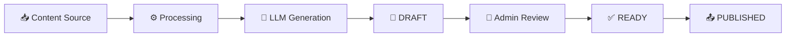
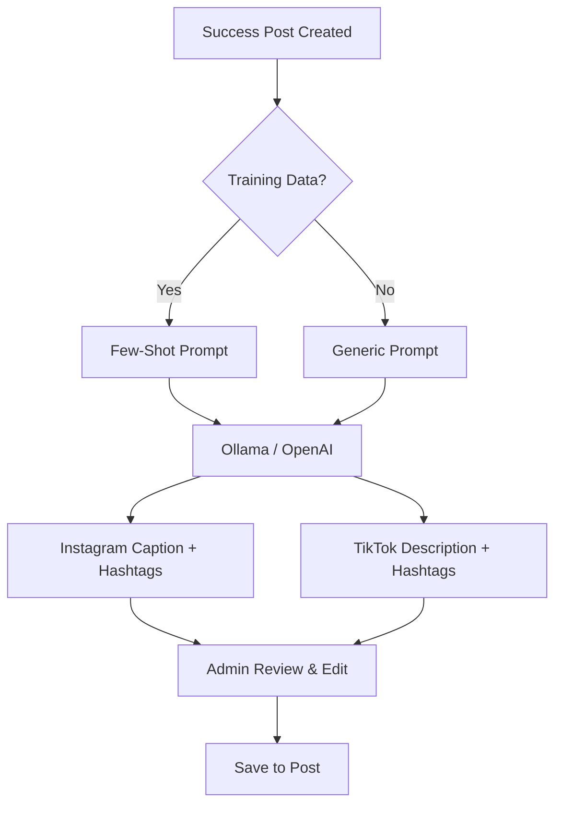

# catchKen Content Hub

AI-powered social media content planner for Swiss driving schools. Automates content generation for Instagram & TikTok using local LLMs, featuring calendar-based scheduling, RSS-powered news posts, theory content, student success stories, and review highlights.

**Work in Progress – Phase 3 complete**

---

## Demo

> *Screenshots coming soon*

---

## Tech Stack

| Component | Technology |
|---|---|
| Backend | Python 3.13 · FastAPI · SQLAlchemy · SQLite |
| Frontend (MVP) | HTML · CSS · JavaScript |
| Frontend (planned) | React |
| AI | Ollama local (OpenAI as fallback) — switchable via `.env` |
| HTTP Client | httpx (async, for LLM communication) |
| Auth | Passlib · bcrypt |
| CI/CD | GitHub Actions (ruff linting · pytest · auto-docs) |
| Containerization | Docker · docker-compose |

---

## Project Structure
```
catchKen/
├── app/
│   ├── main.py                    # FastAPI entry point
│   │
│   ├── core/                      # Infrastructure
│   │   ├── config.py              # App settings from .env
│   │   ├── database.py            # SQLAlchemy engine & sessions
│   │   └── security.py            # Password hashing (bcrypt)
│   │
│   ├── models/                    # Database models (8 tables)
│   │   ├── user.py                # Admin accounts
│   │   ├── student_success_post.py # Passed students content
│   │   ├── training_post.py       # Training data for few-shot prompting
│   │   ├── content_source.py      # RSS feeds, Google Reviews
│   │   ├── news_item.py           # Scanned news articles
│   │   ├── content_idea.py        # LLM-generated suggestions
│   │   ├── scheduled_post.py      # Calendar entries
│   │   └── asset.py               # Images, videos
│   │
│   ├── schemas/                   # Pydantic request/response models
│   │   ├── student_success.py     # Success post + LLM generation schemas
│   │   └── training_data.py       # Training data upload schemas
│   │
│   ├── routers/                   # API endpoints
│   │   ├── student_success.py     # CRUD + LLM generate for success posts
│   │   └── training_data.py       # Training data upload & management
│   │
│   ├── services/                  # Business logic
│   │   └── llm/                   # LLM integration
│   │       ├── __init__.py        # Package exports
│   │       ├── base_provider.py   # Abstract provider interface (ABC)
│   │       ├── ollama_provider.py # Ollama implementation
│   │       ├── provider_factory.py # Provider selection from config
│   │       ├── prompts.py         # Prompt templates (generic + few-shot)
│   │       └── training_data.py   # Training data loading & formatting
│   │
│   └── utils/                     # Helper functions
│
├── frontend/
│   ├── static/
│   │   ├── css/style.css          # Main stylesheet
│   │   ├── js/app.js              # Frontend logic
│   │   └── img/
│   └── templates/
│       └── index.html             # Main page with form & post list
│
├── scripts/
│   └── generate_docs.py           # Auto-documentation generator
│
├── docs/
│   ├── content-pipeline.md        # Mermaid pipeline diagrams
│   └── auto-generated.md          # Auto-updated on each push
│
├── tests/
├── media/ → SSD symlink           # Uploads (not in repo)
├── .github/workflows/
│   ├── ci.yml                     # Linting + tests
│   └── docs.yml                   # Auto-generate documentation
├── Dockerfile                     # Container build
├── docker-compose.yml             # Container orchestration
├── .dockerignore
├── .env.example
├── .gitignore
├── requirements.txt
└── README.md
```

---

## Getting Started

### Prerequisites

- Python 3.13+
- Git
- [Ollama](https://ollama.ai) (for local LLM generation)

### Setup
```bash
# Clone the repository
git clone https://github.com/NoahRolli/contentHub_catchKen.git
cd contentHub_catchKen

# Create and activate virtual environment
python3 -m venv .venv
source .venv/bin/activate  # macOS/Linux

# Install dependencies
pip install -r requirements.txt

# Configure environment variables
cp .env.example .env

# Start Ollama (separate terminal)
ollama serve
ollama pull llama3.2

# Start the server
uvicorn app.main:app --reload
```

### Access

- **App:** [http://127.0.0.1:8000](http://127.0.0.1:8000)
- **API Docs:** [http://127.0.0.1:8000/docs](http://127.0.0.1:8000/docs)
- **Health Check:** [http://127.0.0.1:8000/health](http://127.0.0.1:8000/health)

---

## Features

### Four Content Types
- 🟢 **Success Posts** – Passed driving students with image, caption & hashtags
- 🔴 **News Posts** – Auto-generated from Swiss RSS feeds with safety tips
- 🔵 **Theory Posts** – Swiss driving theory content with quizzes
- 🟡 **Reviews** – Google Reviews repurposed as social media content

### LLM Content Generation (Phase 3)
- **Two generation modes:**
  - **Generic mode** – LLM generates captions from a standard prompt when no training data exists
  - **Few-shot mode** – LLM imitates the style of real posts when training data is uploaded
- **Dual platform output** – Generates both Instagram caption + hashtags and TikTok description per post
- **Provider system** – Switchable between Ollama (local) and OpenAI (cloud fallback) via `.env`
- **Editorial control** – Generated content is previewed before saving, admin can edit before publishing

### Training Data System
- Upload real Instagram/TikTok posts as few-shot examples
- Import from Instagram JSON export (official Meta download)
- Bulk upload via API
- Separate training data per platform (Instagram vs TikTok) and content type
- Stats endpoint to monitor training data coverage

### Planning System
- Calendar view (week / 2 weeks / month)
- Drag & drop scheduling
- Status workflow: `DRAFT` → `READY` → `PUBLISHED`
- Sidebar with unplanned content

### Export
- ZIP download with CSV schedule, images, captions & checklist
- No auto-posting in MVP – full editorial control

### Current Status

- [x] Project structure with `app/core/` architecture
- [x] FastAPI server with health check
- [x] Config, database, security foundation
- [x] All 8 database models (User, StudentSuccessPost, TrainingPost, ContentSource, NewsItem, ContentIdea, ScheduledPost, Asset)
- [x] Pydantic schemas for validation
- [x] Success posts CRUD (create, read, update, delete)
- [x] Image upload to SSD via symlink
- [x] Consent validation (required for student images)
- [x] Frontend form with post list
- [x] CI pipeline (ruff linting + pytest)
- [x] Auto-generated documentation
- [x] Docker setup (Dockerfile + docker-compose)
- [x] LLM integration (Ollama provider with async HTTP)
- [x] Provider interface (ABC) for swappable LLM backends
- [x] Prompt templates (generic + few-shot modes)
- [x] Training data model, schemas & CRUD endpoints
- [x] Instagram JSON import for training data
- [x] Content generation endpoint (Instagram + TikTok)
- [x] Apply-generated endpoint (save after review)
- [ ] Prompt tuning (hashtag separation, quote removal)
- [ ] Theory post generation
- [ ] RSS news scanning & filtering
- [ ] Google Reviews integration
- [ ] Calendar view with drag & drop
- [ ] ZIP export
- [ ] React frontend migration

---

## Content Pipeline

```mermaid
graph LR
    A[📥 Content Source] --> B[⚙️ Processing]
    B --> C[🤖 LLM Generation]
    C --> D[📝 DRAFT]
    D --> E[👀 Admin Review]
    E --> F[✅ READY]
    F --> G[📤 PUBLISHED]
```

### LLM Generation Flow

```mermaid
graph TD
    A[Success Post Created] --> B{Training Data?}
    B -->|Yes| C[Few-Shot Prompt]
    B -->|No| D[Generic Prompt]
    C --> E[Ollama / OpenAI]
    D --> E
    E --> F[Instagram Caption + Hashtags]
    E --> G[TikTok Description + Hashtags]
    F --> H[Admin Review & Edit]
    G --> H
    H --> I[Save to Post]
```

*Detailed diagrams: [docs/content-pipeline.md](docs/content-pipeline.md)*

---

## API Endpoints

### Success Posts
| Method | Endpoint | Description |
|--------|----------|-------------|
| POST | `/api/success/` | Create new success post |
| GET | `/api/success/` | List all success posts |
| GET | `/api/success/{id}` | Get single post |
| PUT | `/api/success/{id}` | Update post |
| DELETE | `/api/success/{id}` | Delete post |
| POST | `/api/success/{id}/generate` | Generate captions via LLM |
| POST | `/api/success/{id}/apply-generated` | Save generated content |

### Training Data
| Method | Endpoint | Description |
|--------|----------|-------------|
| POST | `/api/training-data/` | Create single training post |
| POST | `/api/training-data/bulk` | Bulk upload training posts |
| POST | `/api/training-data/import-instagram` | Import Instagram JSON export |
| GET | `/api/training-data/` | List training posts |
| GET | `/api/training-data/stats` | Training data statistics |
| DELETE | `/api/training-data/{id}` | Delete single training post |
| DELETE | `/api/training-data/` | Delete all (with optional filter) |

---

## Roadmap

| Phase | Description | Status |
|-------|-------------|--------|
| 1 | Foundation & project structure | ✅ Complete |
| 2 | Success posts CRUD & frontend | ✅ Complete |
| 3 | LLM integration (Ollama) | ✅ Complete |
| 4 | Theory posts | ⏳ Planned |
| 5 | News posts (RSS) | ⏳ Planned |
| 6 | Reviews | ⏳ Planned |
| 7 | Calendar & scheduling | ⏳ Planned |
| 8 | Export & polish | ⏳ Planned |
| 9 | React migration (optional) | ⏳ Planned |

---

## Security

- Secrets in `.env` (never in code or on GitHub)
- Password hashing with bcrypt
- SQLAlchemy ORM (protects against SQL injection)
- Pydantic validation on all inputs
- Consent required for student images
- No full article reproduction (LLM summaries only)

---

## CI/CD

Automated pipelines run on every push to `main`:
- **Linting** with [ruff](https://github.com/astral-sh/ruff)
- **Tests** with pytest (coming soon)
- **Documentation** auto-generated from code

---

## Documentation

- **API Docs (live):** [http://127.0.0.1:8000/docs](http://127.0.0.1:8000/docs)
- **Content Pipeline:** [docs/content-pipeline.md](docs/content-pipeline.md)
- **Auto-generated:** [docs/auto-generated.md](docs/auto-generated.md)

---

## Versioning

This project follows [Semantic Versioning](https://semver.org/):
`v0.1.0` → `v0.2.0` → `v1.0.0`

---

## License

*Not yet defined.*

---

## Author

**Noah Rolli** – [GitHub](https://github.com/NoahRolli)