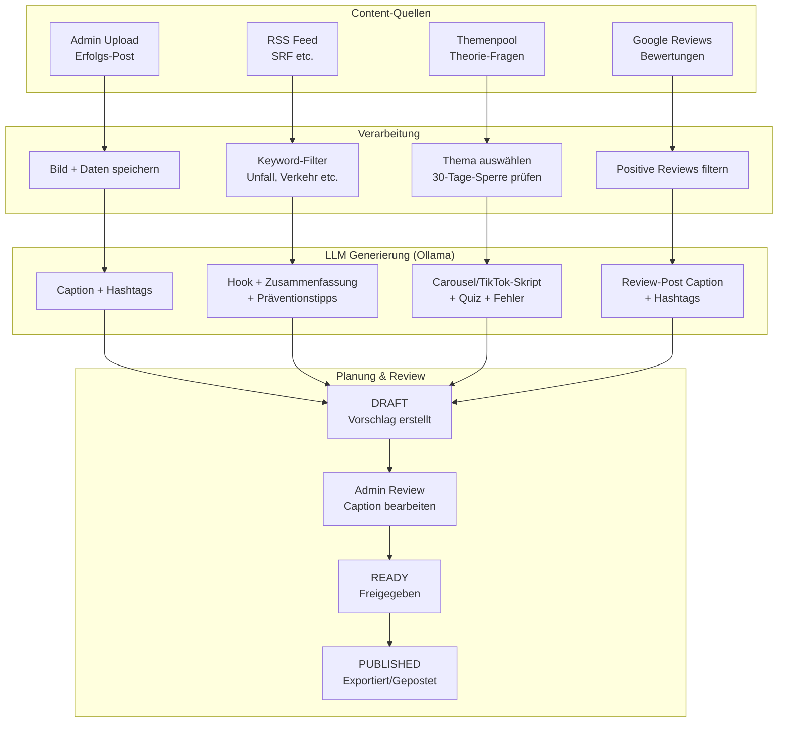
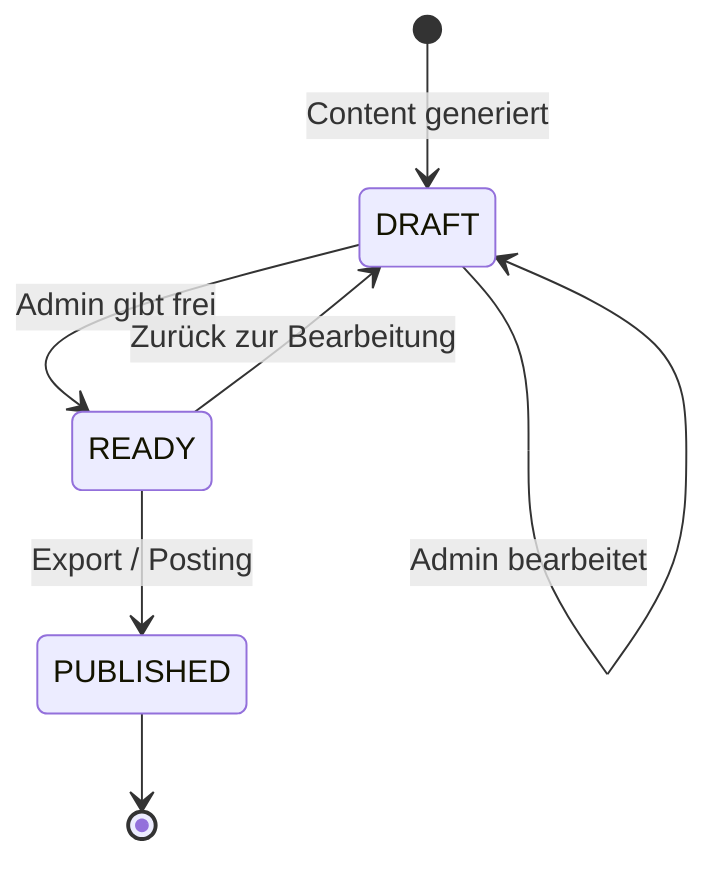
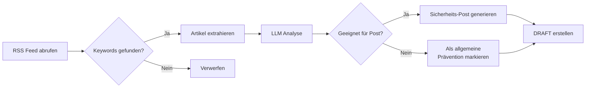
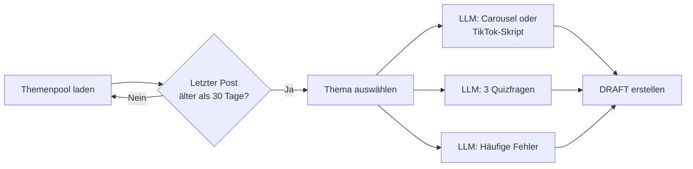

# Content Pipeline – catchKen Content Hub

## Gesamtübersicht

Wie Content von der Quelle bis zum fertigen Post fliesst:

## Status-Workflow

## News-Post Pipeline (Detail)

## Theorie-Post Pipeline (Detail)
